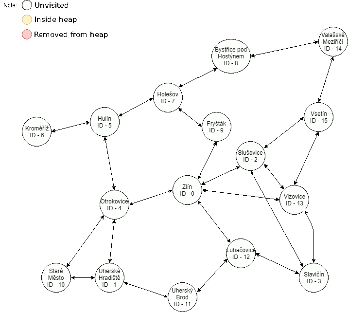

# Dijkstrův algoritmus s použitím haldy

Algoritmus slouží k nalezení **nejkratší cesty mezi zadaným vrcholem a všemi ostatními.**
Jednotlivé cesty mezi prvky si uchováme v poli (poslouží struktura tDijkstra), kterou si budeme muset inicializovat, 
aby všechny prvky v poli distances byly nastavené na 'INF' (Je definováno jako maximální hodnota unsigned) kromě však jednoho
prvku a to našeho zadaného vrcholu, který nastavíme na 0 (--> Nejkratší cesta ze zadaného vrcholu je 0)

Město je popsáno následující strukturou, její podrobnější popis můžeme najít v hlavičkovém souboru data.h:
```
typedef struct {
  unsigned id;
  char name[256]; 
  unsigned roadLength[8];
  unsigned roadCityIndex[8];
  unsigned distance;
} Data_t;
```
Každé město má své **id** - neboli pořadí, ve kterém je přečteno z csv souboru, jméno (**name**), pole délky cest(**roadLength**) - těchto cest může mít každé město až 8, 
z města vede cesta pouze pokud je délky cesty větší než 0. Pokud je délky cesty delší než 0, 
je spojeno s městem, které nalezmene v poli **roadCityIndex** na stejném indexu v poli, jako byla délka cesty.
**distance** nám poté slouží jakožto hodnota, podle které třídíme naši haldu a ukládá se zde vypočtená délka trasy ze startivního města, proto před vložením města do haldy nezapomeňte tuto hodnotu změnit na Vámi vypočítanou.

Například Zlín z obrázku níže by ve struktuře vypadal následovně:

```
typedef struct {
  unsigned id = 0;
  char name = Zlín; 
  unsigned roadLength[0] = 12;
  unsigned roadLength[1] = 9;
  unsigned roadLength[2] = 8;
  unsigned roadLength[3] = 16;
  unsigned roadLength[4] = 28;
  unsigned roadLength[5] = 0;
  unsigned roadLength[6] = 0;
  unsigned roadLength[7] = 0;
  unsigned roadCityIndex[0] = 2;
  unsigned roadCityIndex[1] = 4;
  unsigned roadCityIndex[2] = 9;
  unsigned roadCityIndex[3] = 13;
  unsigned roadCityIndex[4] = 12;
  unsigned roadCityIndex[5] = 0;
  unsigned roadCityIndex[6] = 0;
  unsigned roadCityIndex[7] = 0;
  unsigned distance = 0;
} tCity;
```

Struktura tDijkstra, se kterou pracujeme vypadá následovně:
```
typedef struct {
  bool *visited;
  unsigned *distances;
} tDijkstra;
```
Struktura obsahuje dvě pole, **visited** - zde si uchováváme informaci o tom, zda-li jsme již dané město "navštívili", dalším pole je
**distances** - zde uchováváme nejkratší vzdálenost od startovního města do ostatních měst
Např město s ID 5 by v poli distances na indexu 5 uchovanou **nejkratší cestu** k němu (Z obrázku níže by tato hodnota byla 11).

Obrázek k csv souboru MAP3.csv:


Pro startovní pozici s městem Zlín, které má index 0 by finální tDijkstra struktura vypadala dle obrázku následovně: 

|Index(City) | Distances |
|------------|-----------|
|     0      |     0     |    
|     1      |    28     |
|     2      |    12     |
|     3      |    40     |
|     4      |     9     |
|     5      |    25     |
|     6      |    33     |
|     7      |    19     |
|     8      |    30     |
|     9      |     8     |
|    10      |    27     |
|    11      |    41     |
|    12      |    28     |
|    13      |    16     |
|    14      |    51     |
|    15      |    31     |

**Jak algoritmus funguje?**

První město můžeme vyřešit snadno,vezmeme-li Zlín, tak zkontrolujeme, ke kterým městům je připojeno cestami 
(Z obrázku můžeme vyčíst, že je připojeno k městům Luhačovice(12), Otrokovice(4), Fryšták(9), Slušovice(2) a Vizovice(13)). 
Zkontrolujeme, zda-li vzdálenost od současného města Zlín (ID 0), je menší, než vzdálenost uložená ve struktuře
tDijkstra, ta v tuto chvíli po inicializaci vypadá následovně:

|Index(City) | Distances |
|------------|-----------|
|     0      |     0     |    
|     1      |   INF     |
|     2      |   INF     |
|     3      |   INF     |
|     4      |   INF     |
|     5      |   INF     |
|     6      |   INF     |
|     7      |   INF     |
|     8      |   INF     |
|     9      |   INF     |
|    10      |   INF     |
|    11      |   INF     |
|    12      |   INF     |
|    13      |   INF     |
|    14      |   INF     |
|    15      |   INF     |

Vzhledem k tomu, že 0 + jakákoli délka cesty z města Zlín je menší než 'INF', zapíšeme tyto hodnoty výše zmíněných měst, které jsou ke Zlínu projpojeny cestou do struktury tDijkstra

|Index(City) | Distances |
|------------|-----------|
|     0      |     0     |    
|     1      |   INF     |
|     2      |    12     |
|     3      |   INF     |
|     4      |     9     |
|     5      |   INF     |
|     6      |   INF     |
|     7      |   INF     |
|     8      |   INF     |
|     9      |     8     |
|    10      |   INF     |
|    11      |   INF     |
|    12      |    28     |
|    13      |    16     |
|    14      |   INF     |
|    15      |   INF     |

Další cesty město s indexem 0 již nemá, proto se můžeme vydat na města, které jsou propojeny s městy, se kterými jsme pracovali před chvílí (Luhačovice(12), Otrokovice(4), Fryšták(9), Slušovice(2) a Vizovice(13))

Průchod celou mapou může nakonec vypadat následovně (Při startovním městě Zlín):



**K vyřešení úkolu použijte haldu z předchozích cvičení**

V poli distances uchováváme pouze hodnoty, které jsou nejkratší -> splňují podmínku, 
že již uložená hodnota k městu, kam vede právě zpracováváná cesta je menší jak celková vzdálenost města, které jsme vzali z haldy + délka právě zpracovávané cesty.

*  Každé město může mít až 8 z něj vedoucích cest (délka cesty 0 => cesta zde není), které jsou uloženy v poli roadsLength (struktura tCity). Jestliže je délka cesty na indexu 'k' větší než 0, pak je právě propojeno s městem, které je uloženo v poli cityIndex taktéž na indexu 'k' (struktura tCity je definována v hlavičkovém souboru map.h)

Program se spouští s 1 argumentem - cesta k csv souboru mapy

Testy se spouští se 2 argumenty -> dva CSV soubory, které můžete nalézt ve složce 'test_files' s názvy 'map1.csv' a 'map2.csv'

**Všechna alokovaná paměť musí být ověřena na přidělení a po konci programu musí být uvolněna!**

**Vaším úkolem je implementace následujících funkcí:**

**Dijkstra_Init** - Inicializuje strukturu tDijkstra

**Dijkstra_Destruct** - Deinicializuje strukturu tDijkstra

**Dijkstra_Dist** - Vytvoří prázdnou haldu, do které vloží naše startovní město. Z této haldy si poté jednotlivě bere města a počítá celkové délky tras do měst, 
ke kterým je připojeno aktuální město cestami, pokud jsou tyto délky kratší jak jich uložené hodnoty ve struktuře tDijkstra, hodnoty přepíšeme. 
To děláme dokud halda není prázdná, nebo neexistuje právě takové město, které nebylo navštíveno.

# EN #

# Dijkstra’s Algorithm using Heap #

The alghorithm is used to find the shortest path between one point and all others. 
The distances between points we're storing in array (structure tDijkstra), which needs to be initialized. Every distance in our array has to be set to 'INF' (Which is defined as maximum value of unsigned)
except one which is our starting point -> distance between starting point and itself is 0, we don't need special algorithm to know that. 

The city is described as a following structure, you can find more details about the structure in header file data.h:
```
typedef struct {
  unsigned id;
  char name[256]; 
  unsigned roadLength[8];
  unsigned roadCityIndex[8];
  unsigned distance;
} Data_t;
```
Every city has its own **id**, **name**, array **roadLength** - each city can have up to 8 roads, 
the road is connected to a city if the road length is greater than 0. If the road length is greater than 0, 
then it is connected to a city, which we find in an array **roadCityIndex** at the same index as the roadLength.
**distance** is used as a value, by which we sort our heap and we store here the calculated distance of from the starting city, so before you insert city into heap, do not forget to change the distance value.

For example Zlín from picture below would in our structure look like this:

```
typedef struct {
  unsigned id = 0;
  char name = Zlín; 
  unsigned roadLength[0] = 12;
  unsigned roadLength[1] = 9;
  unsigned roadLength[2] = 8;
  unsigned roadLength[3] = 16;
  unsigned roadLength[4] = 28;
  unsigned roadLength[5] = 0;
  unsigned roadLength[6] = 0;
  unsigned roadLength[7] = 0;
  unsigned roadCityIndex[0] = 2;
  unsigned roadCityIndex[1] = 4;
  unsigned roadCityIndex[2] = 9;
  unsigned roadCityIndex[3] = 13;
  unsigned roadCityIndex[4] = 12;
  unsigned roadCityIndex[5] = 0;
  unsigned roadCityIndex[6] = 0;
  unsigned roadCityIndex[7] = 0;
  unsigned distance = 0;
} tCity;
```

The structure tDijkstra:
```
typedef struct {
  bool *visited;
  unsigned *distances;
} tDijkstra;
```
Structure contains two arrays **visited** - here we store information if the city was visited or no.
The second array is **distances** - Here we store the shortest path from the starting city to other cities. 
For example - city with an ID of 5 would have in array **distances** at the index of 5 stored the **shortest distance** to it (From our picture the value would be 11).


From the picture our distances array in tDijkstra structure would look like this with starting position at index 0

For the starting city with the index 0 from our picture would look the final tDijkstra structure like this: 

|Index(City) | Distances |
|------------|-----------|
|     0      |     0     |    
|     1      |    28     |
|     2      |    12     |
|     3      |    40     |
|     4      |     9     |
|     5      |    25     |
|     6      |    33     |
|     7      |    19     |
|     8      |    30     |
|     9      |     8     |
|    10      |    27     |
|    11      |    41     |
|    12      |    28     |
|    13      |    16     |
|    14      |    51     |
|    15      |    31     |

**How does Dijkstra algorithm work?**

First city(for example Zlín) is pretty easy, we will check, to which city it is connected with roads (From our picture we can clearly see its connected to Luhačovice(12), Otrokovice(4), Fryšták(9), Slušovice(2) and Vizovice(13)).
We will check, if the distance of the current city Zlín (Index 0), is lower that already stored value in tDijkstra structure.
The structure at this point looks like this:

|Index(City) | Distances |
|------------|-----------|
|     0      |     0     |    
|     1      |   INF     |
|     2      |   INF     |
|     3      |   INF     |
|     4      |   INF     |
|     5      |   INF     |
|     6      |   INF     |
|     7      |   INF     |
|     8      |   INF     |
|     9      |   INF     |
|    10      |   INF     |
|    11      |   INF     |
|    12      |   INF     |
|    13      |   INF     |
|    14      |   INF     |
|    15      |   INF     |

0 + any road length is lower that 'INF', so we store those lower values in our array to, so it looks like this:

|Index(City) | Distances |
|------------|-----------|
|     0      |     0     |    
|     1      |   INF     |
|     2      |    12     |
|     3      |   INF     |
|     4      |     9     |
|     5      |   INF     |
|     6      |   INF     |
|     7      |   INF     |
|     8      |   INF     |
|     9      |     8     |
|    10      |   INF     |
|    11      |   INF     |
|    12      |    28     |
|    13      |    16     |
|    14      |   INF     |
|    15      |   INF     |

There are no more roads connected to our city with the index of 0, so we move to city 1 and 7 with the same procedure.

The process of the whole map might look like following (Starting city is Zlin):


**To successfuly complete this use heap from previous task**

In our array called distances we store only the shortest path -> they meet this condition - the stored value is lower than the distance to city that we took from heap + the lenght of the current road that we're working with.

* Every city can have up to 8 roads that lead to another city (lenght of 0 => there's no road), which are stored in array roadsLenght (tCity structure) => If the lenght of the road on index 'K' is higher than 0, then this road is connected to city which is stored in array cityIndex on the same index 'K' (structure tCity is defined in header file map.h)

The program runs with 1 argument -> path to map with csv format (You can find maps in 'test_files' folders)

The tests run with 2 arguments -> 2 paths to map, you can find those in 'test_files' folder named 'map1.csv' and 'map2.csv'

**Any allocated memory has to be released at the end of program!**

## IMPLEMENT THOSE FUNCTIONS IN C

More detailed info about the functions you can find in header file 'dijkstra.h'

**Dijkstra_Init** - Initializes the tDijkstra structure

**Dijkstra_Destruct** - Deinitializes the tDijkstra structure

**Dijkstra_Dist** - Creates an empty heap in which we insert out starting city. 
From this heap process every city one by one and count distances between current city and the city that is connected to with a road, 
if the distance is shorter store value. Do this until the heal is empty or there is no city, that was not visited.

### Ukázka běhu programu/Example of program: ###

```
Dijkstra v1.1
-------------
0 - Load map frop csv file
1 - Choose starting city
2 - Choose destination
3 - Find shortest path
M - MENU
E - Exit
0

Your choice: 0 - Load map frop csv file


Loaded cities:
Zlín
Uherské Hradiště
Zádveřice
Slavičín
Otrokovice
Hulín
Kroměříž
Holešov
Bystřice pod Hostýnem
Fryšták
Staré Město
Uherský Brod
Luhačovice
Vizovice
Valašské Meziříčí
Vsetín
Map initialized!
Number of cities loaded: 16
2

Your choice: 2 - Choose destination

Current destination: Zlín with index 0
Please type a name of a city to search: Krom
Found cities: 
Kroměříž with index 6
Enter index of city (-1) if your city was not found.
6
New destination is now Kroměříž with index of 6
3

Your choice: 3 - Find shortest path

The shortest path to Kroměříž is 34 km long
To Zlín [0] km
To Uherské Hradiště [28] km
To Zádveřice [61] km
To Slavičín [40] km
To Otrokovice [9] km
To Hulín [21] km
To Kroměříž [34] km
To Holešov [19] km
To Bystřice pod Hostýnem [32] km
To Fryšták [8] km
To Staré Město [27] km
To Uherský Brod [48] km
To Luhačovice [52] km
To Vizovice [16] km
To Valašské Meziříčí [60] km
To Vsetín [34] km
Dijkstra v1.1
-------------
0 - Load map frop csv file
1 - Choose starting city
2 - Choose destination
3 - Find shortest path
M - MENU
E - Exit
1

Your choice: 1 - Choose starting city

Current starting city: Zlín with index 0
        
Please type a name of a city to search: Vizovice
Found cities: 
Vizovice with index 13
Enter index of city (-1) if your city was not found.
13
New starting city is now Vizovice with index of 13
3

Your choice: 3 - Find shortest path

The shortest path to Kroměříž is 50 km long
To Zlín [16] km
To Uherské Hradiště [44] km
To Zádveřice [45] km
To Slavičín [24] km
To Otrokovice [25] km
To Hulín [37] km
To Kroměříž [50] km
To Holešov [35] km
To Bystřice pod Hostýnem [48] km
To Fryšták [24] km
To Staré Město [43] km
To Uherský Brod [49] km
To Luhačovice [36] km
To Vizovice [0] km
To Valašské Meziříčí [38] km
To Vsetín [18] km
Dijkstra v1.1
-------------
0 - Load map frop csv file
1 - Choose starting city
2 - Choose destination
3 - Find shortest path
M - MENU
E - Exit

```
