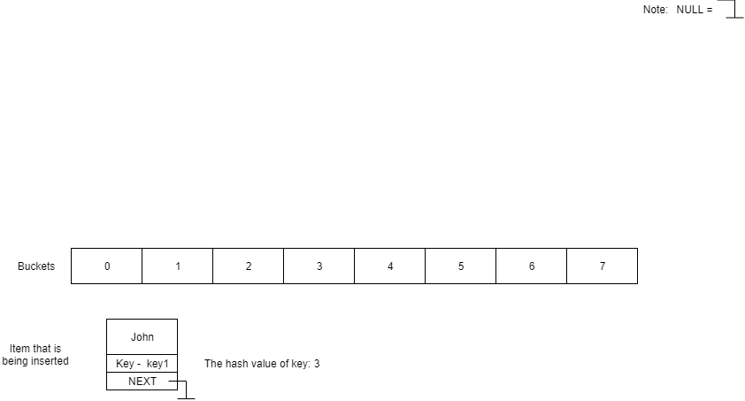

# HashTable #

Hash-table je datová struktura, která pomocí unikátního klíče (V tabulce nesmí být 2 stejné klíče) vypočítá neunikátní hodnotu (Index bucketu v hash-tabulce), do které se vloží požadovaná data.

Pro hašování klíče využijte funkce 'hash' z knihovny 'hash-private.h'

Zde si můžete vyzkoušet jak hash-tabulka funguje [HASH-TABULKA VIZUALIZACE](https://www.cs.usfca.edu/~galles/visualization/OpenHash.html)

# Příklad vkládání do Hash-tabulky #


**Všechna alokovaná paměť musí být ověřena na přidělení a po konci programu musí být uvolněna!**

**Implementuje následující funkce pro hash tabulku:**

Podrobnější popis funkcí naleznete v hlavičkovém souboru table.h

- **HashTable_Init** - Inicializuje hash tabulku

- **HashTable_Destruct** - Destruuje tabulku

- **HashTable_Insert** - Zkontroluje, zda-li hash tabulka již neobsahuje zadaný klíč, pokud klíč neobsahuje, vloží data do hash tabulky, jinak vrátí false

- **HashTable_Delete** - Smaže prvek z tabulky dle zadaného klíče

- **HashTable_Find** - Najde data v tabulce podle zadaného klíče

- **HashTable_Get_Count** - Funkce na zjištění počtu prvků v hash tabulce

- **HashTable_Clear** - Smaže veškeré prvky z hash tabulky

- **HashTable_Process** - Projde všechny prvky v hash tabulce pomocí 'proc' funkce

# EN #

# HashTable #

Hash table is a data sctructure, which with unique key (Key can be in the table only once) counts non-unique value (Index of a bucket in hash table), where are the data being stored.

Hash-table je datová struktura, která pomocí unikátního klíče (V tabulce nesmí být 2 stejné klíče) vypočítá neunikátní hodnotu (Index bucketu v hash-tabulce).

Pro hašování klíče využijte funkce 'hash' z knihovny 'hash-private.h'

# Example of inserting into hash-table #


**Any allocated memory has to be released at the end of program.**

**Implement following functions for hash table:**

More detailed informations about the functions you can find in header file table.h

- **HashTable_Init** - Initializes the has table

- **HashTable_Destruct** - Destroys the hash table

- **HashTable_Insert** - Checks, if the table has already key that we want to insert, if it does not contain the key, we insert the data, if it does returns false

- **HashTable_Delete** - Deletes the items with a specific key from a table

- **HashTable_Find** - Finds the data from hash table with a specific key

- **HashTable_Get_Count** - Functions that returns count of items in hash table

- **HashTable_Clear** - Deletes every item from hash table

- **HashTable_Process** - Processes every item from hash table with function 'proc'

### Ukázka běhu programu/Example of program: ###

```
Hash table
----------

1 - HashTable_Init()
2 - HashTable_Destruct()
3 - HashTable_Insert()
4 - HashTable_Delete()
5 - HashTable_Find()
6 - HashTable_Get_Count()
7 - HashTable_Clear()
8 - HashTable_Process()
9 - HashTable_Replace()
M - MENU
E - END
Your choice:
Enter the width of table (for example 1000):
myMalloc: allocating 8192 bytes, memory allocated 8192 bytes
Table was initialized.

Your choice:
Please enter a key:
myMalloc: allocating 264 bytes, memory allocated 8456 bytes
Please, enter those values:
Name: 
Enter age: 
Enter weight: 
Enter height: myMalloc: allocating 288 bytes, memory allocated 8744 bytes
hash: Key: 123 -> Hash index: 150
myMalloc: allocating 24 bytes, memory allocated 8768 bytes

Your choice:
Please enter a key:
myMalloc: allocating 264 bytes, memory allocated 9032 bytes
Please, enter those values:
Name: 
Enter age: 
Enter weight: 
Enter height: myMalloc: allocating 288 bytes, memory allocated 9320 bytes
HashTable_Insert failed. Might be because of duplicate key.
myFree: releasing 264 bytes, memory allocated 9056 bytes
myFree: releasing 288 bytes, memory allocated 8768 bytes

Your choice:
Please enter a key:
myMalloc: allocating 264 bytes, memory allocated 9032 bytes
Please, enter those values:
Name: 
Enter age: 
Enter weight: 
Enter height: myMalloc: allocating 288 bytes, memory allocated 9320 bytes
hash: Key: 777123456789 -> Hash index: 642
myMalloc: allocating 24 bytes, memory allocated 9344 bytes

Your choice:
Please enter a key:
myMalloc: allocating 264 bytes, memory allocated 9608 bytes
Please, enter those values:
Name: 
Enter age: 
Enter weight: 
Enter height: myMalloc: allocating 288 bytes, memory allocated 9896 bytes
hash: Key: 604111222333 -> Hash index: 604
myMalloc: allocating 24 bytes, memory allocated 9920 bytes

Your choice:
Please enter a key:
myMalloc: allocating 264 bytes, memory allocated 10184 bytes
Please, enter those values:
Name: 
Enter age: 
Enter weight: 
Enter height: myMalloc: allocating 288 bytes, memory allocated 10472 bytes
hash: Key: 576035111 -> Hash index: 461
myMalloc: allocating 24 bytes, memory allocated 10496 bytes

Your choice:
Key: 123
 -> Value: Pepa, 13.0, 40.0, 150.0
Key: 576035111
 -> Value: Alena Vratna, 55.0, 68.0, 150.0
Key: 604111222333
 -> Value: Josef Slany, 30.0, 80.0, 175.0
Key: 777123456789
 -> Value: Jan Zahradil, 60.0, 55.0, 180.0

Your choice:
myFree: releasing 264 bytes, memory allocated 10232 bytes
myFree: releasing 288 bytes, memory allocated 9944 bytes
myFree: releasing 24 bytes, memory allocated 9920 bytes
myFree: releasing 264 bytes, memory allocated 9656 bytes
myFree: releasing 288 bytes, memory allocated 9368 bytes
myFree: releasing 24 bytes, memory allocated 9344 bytes
myFree: releasing 264 bytes, memory allocated 9080 bytes
myFree: releasing 288 bytes, memory allocated 8792 bytes
myFree: releasing 24 bytes, memory allocated 8768 bytes
myFree: releasing 264 bytes, memory allocated 8504 bytes
myFree: releasing 288 bytes, memory allocated 8216 bytes
myFree: releasing 24 bytes, memory allocated 8192 bytes
Every item in a table were cleared.

Your choice:
myFree: releasing 8192 bytes, memory allocated 0 bytes
Table destructed.

Your choice:
END.
```
